

   

Colosseum is a pioneering Python package that creates a bridge between theory and practice in tabular reinforcement
learning with an eye on the non-tabular setting.

## Colosseum principal capabilities

#### Hardness analysis
Colosseum provides practical tools to investigate the theoretical hardness of the reinforcement learning problem in Markov Decision 
Processes.
Concretely, Colosseum implements the following functionalities.

- The computation of three theoretical measures of hardness, the _diameter_ [1], the _sum of the reciprocals of the sub-optimality
gaps_ [2] and the _environmental value norm_ [3].
- The first efficient implementations of the algorithms to identify the communication class of MDPs [4].
- The computation of the exact expected regret in the continuous and episodic settings.
- Visual representations of the MDPs, such as state/state-action pairs visitation counts and state/state-action pairs value functions.

#### Principled benchmarks
Colosseum implements principled benchmarks for the four most widely studied tabular reinforcement learning settings,
_episodic ergodic_, _episodic communicating_, _continuous ergodic_ and _continuous communicating_.
The environments were selected to maximize diversity with respect to two important measures of hardness,
the *diameter* and the *environmental value norm*, thus providing a varied set of challenges for which a 
*precise* characterization of hardness is available. 

## Available tutorials

#### Agent/MDP interaction
The goal of this [tutorial](tutorials/agentMDP_interaction.ipynb) is to introduce how to run a single Agent/MDP interaction for a given number of time steps. This simple functionality can be particularly useful when developing a novel algorithm as it fully provides all the metrics available in Colosseum (expected cumulative regret, expected cumulative rewards, etc.)

#### Colosseum experience: from zero to benchmarked
This [tutorial](tutorials/agent_implementation_tutorial.ipynb) will guide you in how to fully leverage Colosseum when developing a novel reinforcement learning algorithm using a basic *Ensemble Q-learning* implementation. You will be shown how to implement the base class for a Colosseum agent, how to visualize metrics from Agent/MDP interactions, how to benchmark your new agent using a small-scale version of the Colosseum benchmark, and how to visualize the results obtained from the benchmarking procedure.

#### Benchmark results analysis
This [tutorial](tutorials/benchmarks_results_analysis.ipynb) provides a quick way to start analysing the result of Colosseum benchmark procedures using the results from the paper as a working example.

#### Custom MDP
This [tutorial](tutorials/custom_mdp.ipynb) is targeted at people that are interested in defining MDPs without the burden of implementing the full Colosseum MDP class. You will be shown how to instantiate a Colosseum MDP object by simply specifying the starting states distribution, the transition kernel and the rewards kernel. The resulting MDP object can be used in Agent/MDP interaction or to compute measures of hardness just as simply as for MDPs fully implemented in Colosseum.

#### Hardness analysis
This [tutorial](tutorials/hardness_analysis.ipynb) shows how to compute measures of hardness for a given MDP class for the four scenarios considered for hardness analysis in the paper.

#### Non-tabular representation
Although Colosseum considers measures of tabular hardness, it is still possible to equip the MDPs with non-tabular state representations and test non-tabular reinforcement learning algorithms. This [tutorial](tutorials/non_tabular_representations.ipynb) presents the state representations available in Colosseum and shows an Agent/MDP interaction using the baseline agents from [bsuite](https://github.com/deepmind/bsuite/).

#### Visual MDP representations
Colosseum allows visualising MDPs as graphs. This [tutorial](tutorials/visual_representations.ipynb) presents the visualisations available in Colosseum. You can see some examples below.

## Example gallery

The code to produce the following plots is available in the tutorials folder.

### Hardness analysis

  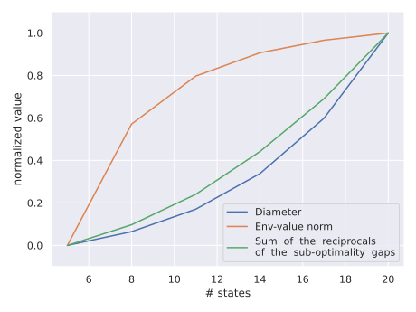

### Agent MDP interaction

  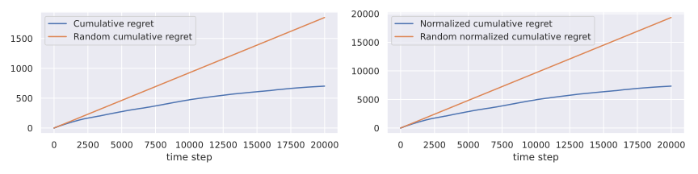

### MDP visual representations

  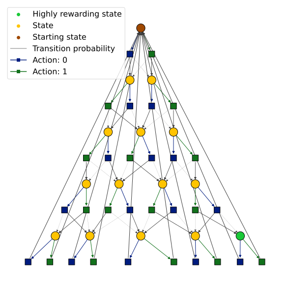
  
  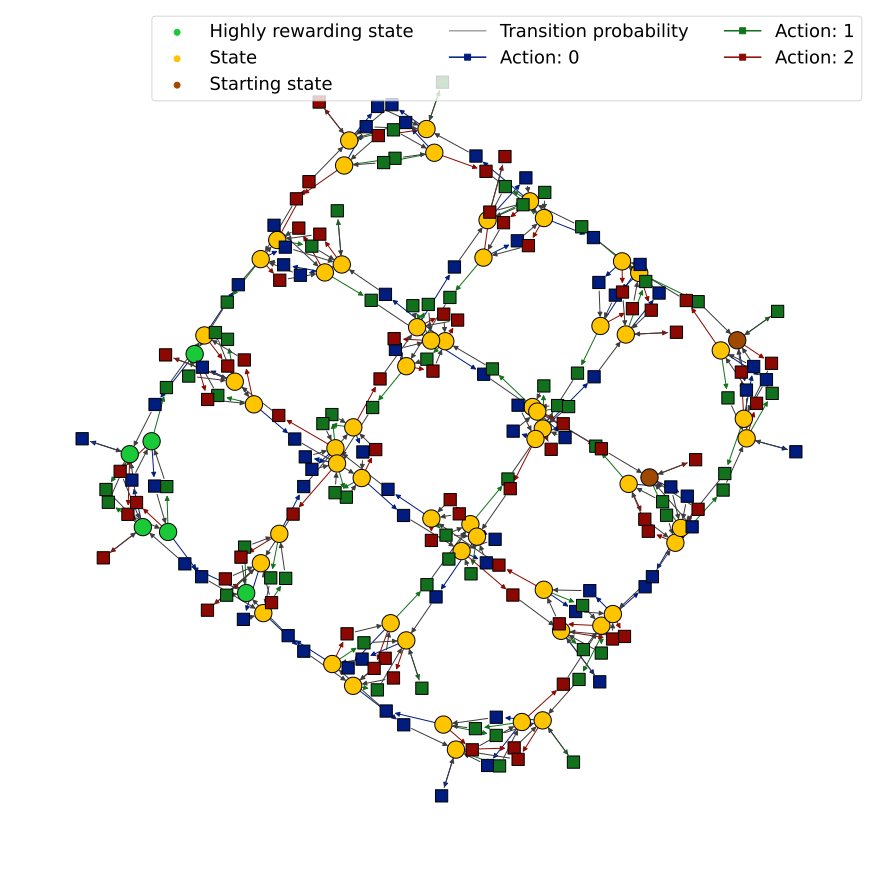
  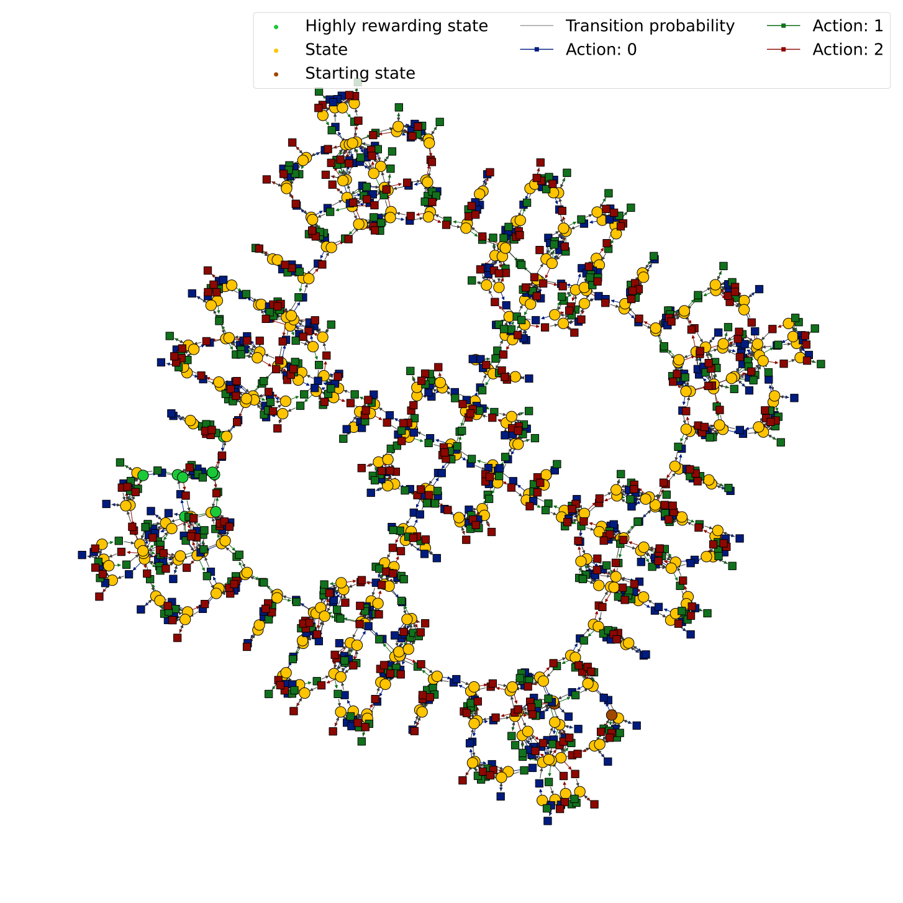

### Markov chain visual representations

  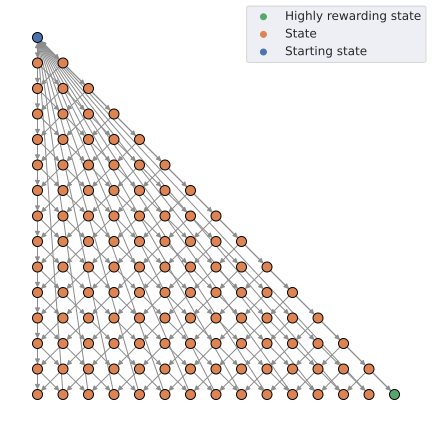
  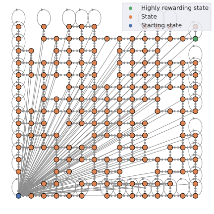
  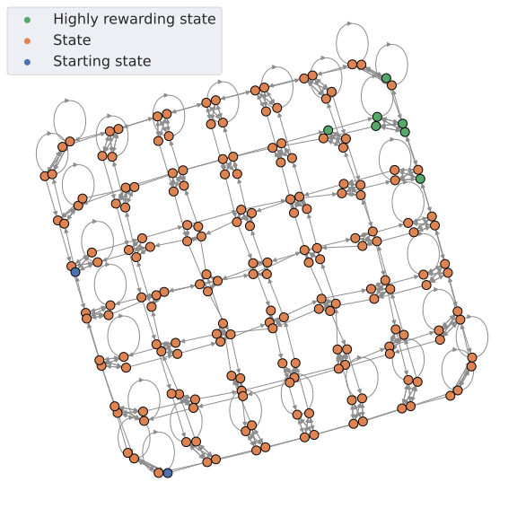
  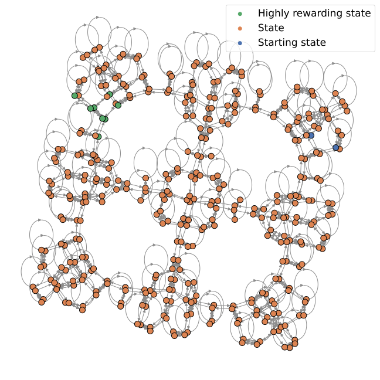

### Visitation counts

  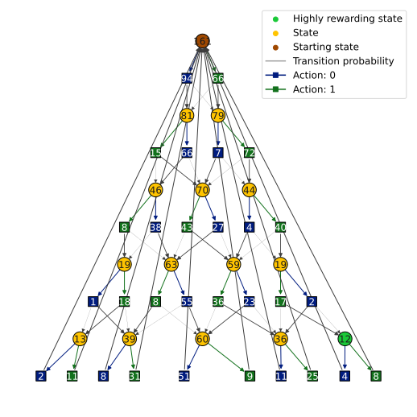
  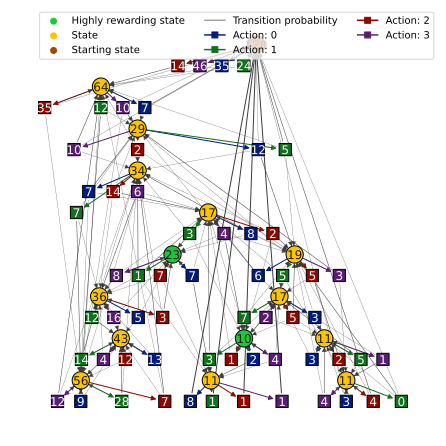
  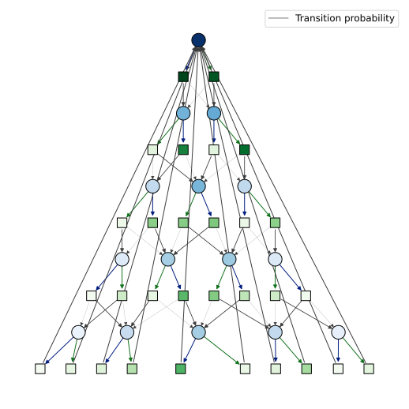
  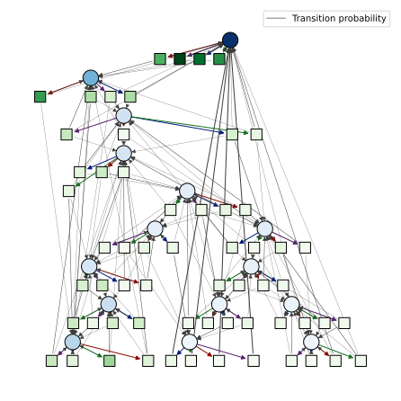

  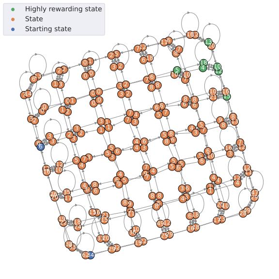
  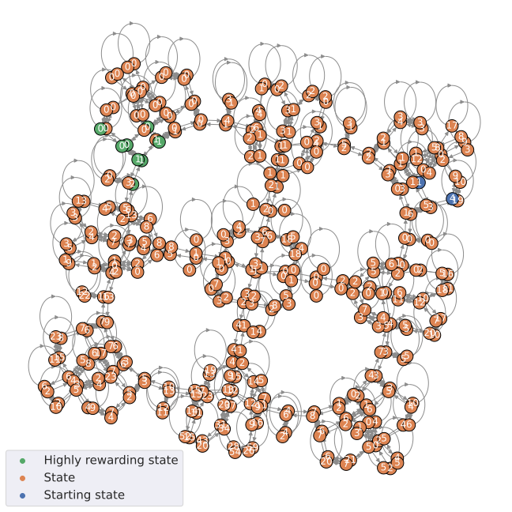
  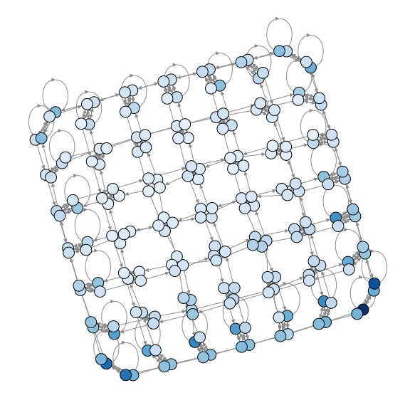
  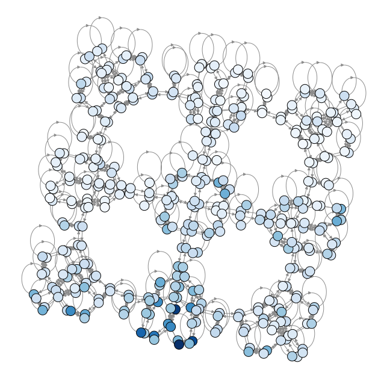

## Acknowledgements
We are grateful for the extraordinary tools developed by the open-source Python community.
We particularly thank the authors of Jupyter Notebook, Matplotlib, NetworkX, Numba, Numpy, Pandas, Scipy, and Seaborn.

## References
[ [1](http://www.jmlr.org/papers/volume11/jaksch10a/jaksch10a.pdf) ] Jaksch, Ortner, and Auer. Near-optimal regret bounds for reinforcement learning. Journal of Machine Learning Research, 11:1563–1600, 2010.
 [ [2](https://proceedings.neurips.cc/paper/2019/file/10a5ab2db37feedfdeaab192ead4ac0e-Paper.pdf) ] Simchowitz, Max, and Kevin G. Jamieson. "Non-asymptotic gap-dependent regret bounds for tabular mdps." Advances in Neural Information Processing Systems 32 (2019).
 [ [3](https://papers.nips.cc/paper/2014/file/2ab56412b1163ee131e1246da0955bd1-Paper.pdf) ] Maillard, Odalric-Ambrym, Timothy A. Mann, and Shie Mannor. "How hard is my MDP?" The distribution-norm to the rescue"." Advances in Neural Information Processing Systems 27 (2014): 1835-1843.
 [ [4](https://link.springer.com/chapter/10.1007/978-1-4613-0265-0_9) ] Kallenberg, L. C. M. "Classification problems in MDPs." Markov processes and controlled Markov chains. Springer, Boston, MA, 2002. 151-165.
